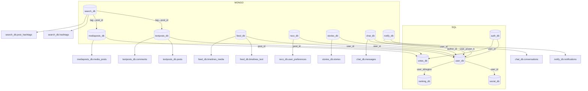
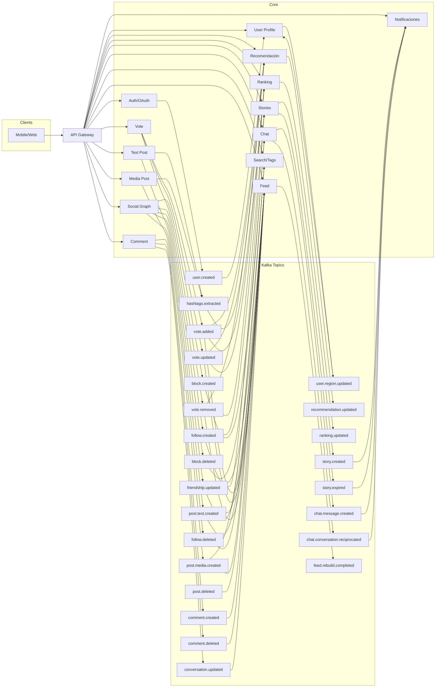

# bestPick

## Entidades en BD

| Servicio dueño | BD (tipo)               | Esquema / Colección | Descripción                            | Claves/Campos principales                                                                                                                                                 | Índices / TTL                                               | Relaciones/Notas                                |
| -------------- | ----------------------- | ------------------- | -------------------------------------- | ------------------------------------------------------------------------------------------------------------------------------------------------------------------------- | ----------------------------------------------------------- | ----------------------------------------------- |
| Auth           | `auth_db` (SQL)         | `users`             | Identidad base                         | `id (UUID PK)`, `email (unique)`, `password_hash`, `created_at`, `status`                                                                                                 | `UNIQUE(email)`                                             | Referenciado por casi todo vía `user_id`        |
| Auth           | `auth_db` (SQL)         | `oauth_clients`     | Apps OAuth                             | `client_id PK`, `client_secret`, `redirect_uris`                                                                                                                          |                                                             |                                                 |
| Auth           | `auth_db` (SQL)         | `oauth_tokens`      | Tokens/refresh                         | `token_id PK`, `user_id FK`, `expires_at`                                                                                                                                 | `INDEX(user_id)`                                            |                                                 |
| Perfiles       | `user_db` (SQL)         | `profiles`          | Perfil público                         | `user_id PK/FK`, `handle UNIQUE`, `display_name`, `bio`, `avatar_url`, `region`, `settings(jsonb)`                                                                        | `UNIQUE(handle)`, `INDEX(region)`                           | FK a `auth_db.users.id`                         |
| Social Graph   | `social_db` (SQL)       | `follows`           | Seguimientos                           | `(follower_id, followee_id) PK`, `created_at`                                                                                                                             | `INDEX(follower_id)`, `INDEX(followee_id)`                  | “Amigos” = mutua existencia                     |
| Social Graph   | `social_db` (SQL)       | `blocks`            | Bloqueos                               | `(blocker_id, blocked_id) PK`, `created_at`, `visible_to_friends`(bool)                                                                                                   | `INDEX(blocker_id)`, `INDEX(blocked_id)`                    | Visible a amigos del `blocker`                  |
| Text Posts     | `textposts_db` (Mongo)  | `posts`             | Posts de texto                         | `_id`, `author_id`, `text`, `hashtags[]`, `created_at`, `visibility`, `score_snapshots{monthly, yearly}`                                                                  | `{author_id, created_at}`, `text` (FTS), `hashtags`         | Metadatos; votos en servicio aparte             |
| Text Posts     | `textposts_db` (Mongo)  | `comments`          | Comentarios tipo YouTube (no anidados) | `_id`, `post_id`, `author_id`, `text`, `mentions[]` (handles), `created_at`, `conversation_id`                                                                            | `post_id`, `conversation_id`, FTS                           | `conversation_id` calculado por Comment Service |
| Votes          | `votes_db` (SQL)        | `post_votes`        | Votos -3..+3 (cubre texto e imagen)    | `(user_id, post_id) PK`, `post_type`(`text`,`media`), `value`(-3..+3), `created_at`, `updated_at`                                                                         | `INDEX(post_id)`, `INDEX(user_id)`                          | Publica eventos de cambios                      |
| Media          | `mediaposts_db` (Mongo) | `media_posts`       | Posts de imagen/vídeo                  | `_id`, `author_id`, `caption`, `hashtags[]`, `assets[{type,image/video,url,duration,thumb}]`, `created_at`, `processing_status`                                           | `author_id`, `created_at`, `hashtags`                       | Bytes en objeto; sin comentarios                |
| Feed           | `feed_db` (Mongo)       | `timelines_text`    | Cache de feed texto por usuario        | `_id: user_id`, `items[{post_id, reason(friend/follow/reco), rank}]`, `updated_at`                                                                                        | `TTL opcional`                                              | Construido por Feed Service                     |
| Feed           | `feed_db` (Mongo)       | `timelines_media`   | Cache de feed media por usuario        | Igual                                                                                                                                                                     | Igual                                                       | Igual                                           |
| Recos          | `reco_db` (Mongo)       | `user_preferences`  | Preferencias por hashtags/temas        | `_id: user_id`, `hashtag_score{tag:float}`, `topic_score{topic:float}`, `last_update`                                                                                     | `INDEX(last_update)`                                        | Actualizado por eventos de votos                |
| Recos          | `reco_db` (Mongo)       | `hashtag_stats`     | Stats por hashtag                      | `_id: hashtag`, `use_count`, `ctr`, `score`                                                                                                                               |                                                             |                                                 |
| Rankings       | `ranking_db` (SQL)      | `leaderboards`      | Líderboards agregados                  | `id PK`, `scope`(`regional`,`global`), `region NULLABLE`, `content_type`(`text`,`media`), `period`(`monthly`,`yearly`), `period_key`(YYYY-MM), `user_id`, `score`, `rank` | `INDEX(period,scope,content_type,region)`, `INDEX(user_id)` | Consumido por API Rankings                      |
| Stories        | `stories_db` (Mongo)    | `stories`           | Stories 24h                            | `_id`, `author_id`, `assets[]`, `created_at`, `expires_at`                                                                                                                | `TTL(expires_at)`                                           | Sin votos                                       |
| Stories        | `stories_db` (Mongo)    | `story_views`       | Quién vio qué                          | `_id`, `story_id`, `viewer_id`, `viewed_at`                                                                                                                               | `story_id`, `viewer_id`                                     |                                                 |
| Chat           | `chat_db` (Mongo)       | `conversations`     | Conversaciones                         | `_id`, `user_a`, `user_b`, `reciprocated_at`, `blocked_by`(nullable), `created_at`                                                                                        | `INDEX(user_a)`, `INDEX(user_b)`                            | Anonimato hasta reciprocidad                    |
| Chat           | `chat_db` (Mongo)       | `messages`          | Mensajes                               | `_id`, `conversation_id`, `sender_id`, `text`, `attachments[]`, `created_at`, `delivered`, `read_at`                                                                      | `conversation_id`, `created_at`                             | Mostrar emisor anónimo si !reciprocated         |
| Notificaciones | `notify_db` (Mongo)     | `notifications`     | Inbox de notifs                        | `_id`, `user_id`, `type`, `payload`, `created_at`, `read_at`                                                                                                              | `user_id`, `created_at`                                     | Origen: eventos Kafka                           |
| Búsqueda/Tags  | `search_db` (Mongo)     | `hashtags`          | Hashtags normalizados                  | `_id: tag`, `created_at`, `last_seen_at`                                                                                                                                  |                                                             | También en stats                                |
| Búsqueda/Tags  | `search_db` (Mongo)     | `post_hashtags`     | Invertido post↔hashtag                 | `_id`, `post_id`, `post_type`, `tag`                                                                                                                                      | `tag`, `post_id`                                            |                                                 |

## Microservicios

| Servicio       | Responsabilidades clave        | BD propia         | Endpoints (ejemplos)                                                                 | Publica (Kafka)                                                          | Consume (Kafka)                                                              | Escalado/Notas                                           |
| -------------- | ------------------------------ | ----------------- | ------------------------------------------------------------------------------------ | ------------------------------------------------------------------------ | ---------------------------------------------------------------------------- | -------------------------------------------------------- |
| API Gateway    | Enrutado, rate-limit, authn    | —                 | `/api/**`                                                                            | —                                                                        | —                                                                            | Spring Cloud Gateway                                     |
| Auth (OAuth)   | OAuth2/OIDC, tokens            | `auth_db` (SQL)   | `/oauth/token`, `/oauth/authorize`, `/users`                                         | `user.created`, `user.updated`                                           | —                                                                            | Spring Authorization Server                              |
| User Profile   | Perfil y settings              | `user_db` (SQL)   | `GET/PUT /profiles/{id}`                                                             | `user.region.updated`                                                    | `user.created`                                                               | Cache regional para rankings                             |
| Social Graph   | Follows, amigos, bloqueos      | `social_db` (SQL) | `POST /follow`, `POST /block`, `GET /friends`                                        | `follow.created/deleted`, `block.created/deleted`, `friendship.updated`  | `user.created`                                                               | Consulta mutua para “amigos”                             |
| Text Post      | Crear/leer posts texto         | `textposts_db`    | `POST /text-posts`, `GET /text-posts/{id}`                                           | `post.text.created`, `post.deleted`, `hashtags.extracted`                | `vote.*`, `comment.*`                                                        | Extrae hashtags al crear                                 |
| Comment        | Comentarios de texto           | `textposts_db`    | `POST /text-posts/{id}/comments`                                                     | `comment.created/deleted`, `conversation.updated`                        | `post.text.created`                                                          | Calcula `conversation_id` por menciones y grafos ligeros |
| Media Post     | Imagen/Vídeo (sin comentarios) | `mediaposts_db`   | `POST /media-posts`, `GET /media-posts/{id}`                                         | `post.media.created`, `post.deleted`, `hashtags.extracted`               | `vote.*`                                                                     | Firma URLs de subida/descarga                            |
| Vote           | Votos [-3..+3]                 | `votes_db` (SQL)  | `PUT /votes/{postId}`                                                                | `vote.added/updated/removed`                                             | `post.*.created`, `post.deleted`                                             | Idempotencia por `(user,post)`                           |
| Feed           | Construcción de timelines      | `feed_db`         | `GET /feeds/text`, `GET /feeds/media`, `POST /feeds/rebuild`                         | `feed.rebuild.completed`                                                 | `post.*.created`, `follow.*`, `friendship.updated`, `recommendation.updated` | Interleaving: amigos→seguidos→reco                       |
| Recomendación  | Preferencias/temas/hashtags    | `reco_db`         | `GET /reco/suggestions`                                                              | `recommendation.updated`                                                 | `vote.*`, `hashtags.extracted`, `post.*.created`                             | Actualiza scores usuario-hashtag                         |
| Ranking        | Leaderboards mensual/anual     | `ranking_db`      | `/rankings?scope=regional\|global&period=monthly\|yearly&content=text\|media`       | `ranking.updated`                                                        | `vote.*`, `user.region.updated`                                              | Kafka Streams ventanas por período                       |
| Stories        | Stories 24h                    | `stories_db`      | `POST /stories`, `GET /stories/following`                                            | `story.created`, `story.expired`                                         | `follow.*`                                                                   | TTL índice por `expires_at`                              |
| Chat           | Mensajería con anonimato       | `chat_db`         | `POST /conversations/{user}`, `POST /messages`                                       | `chat.message.created`, `chat.conversation.reciprocated`, `chat.blocked` | `block.*`                                                                    | Oculta perfil hasta reciprocidad                         |
| Notificaciones | Fanout de eventos a inbox      | `notify_db`       | `GET /notifications`                                                                 | —                                                                        | (casi todos)                                                                 | Tipos: follow, comment, vote, msg                        |
| Search/Tags    | Descubrir por hashtag          | `search_db`       | `GET /search?tag=`                                                                   | `tag.stats.updated`                                                      | `hashtags.extracted`                                                         | Texto y hashtag inverted index                           |

